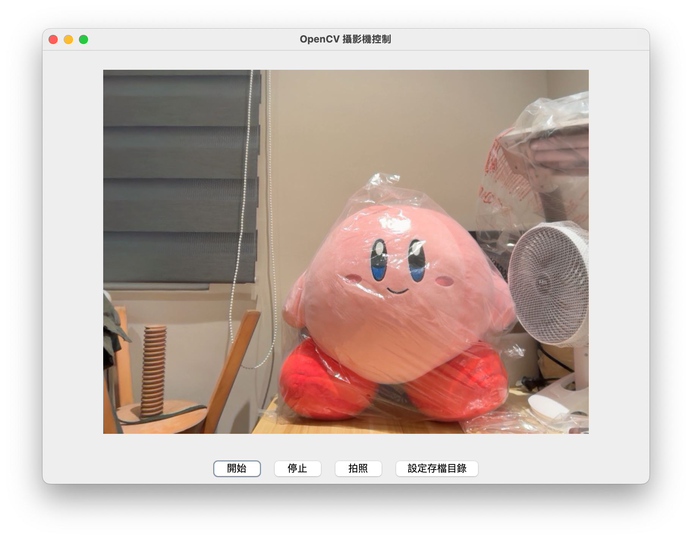
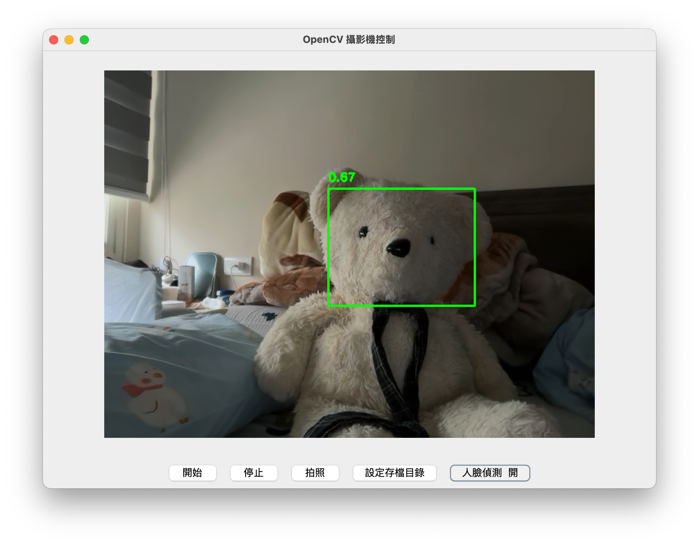
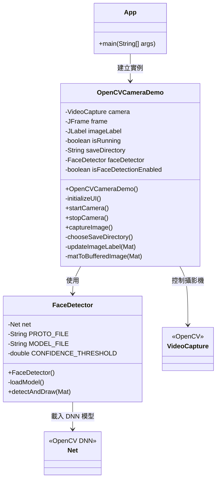
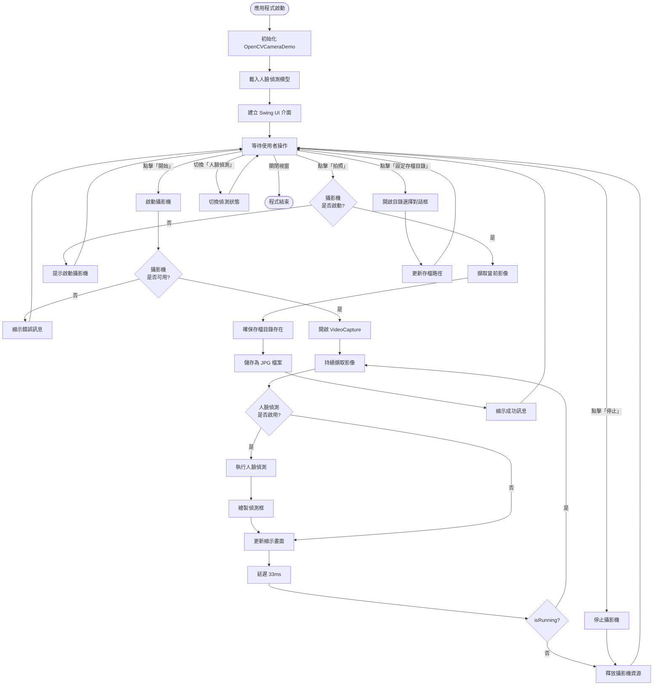
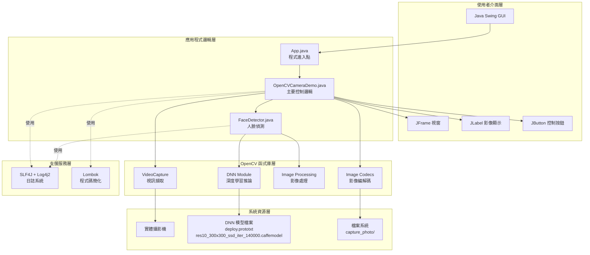

# FTC_OpenCV - OpenCV 攝影機展示專案

這是一個簡單的 Java Swing 應用程式，用以展示如何使用 OpenCV 從攝影機擷取即時影像。

## 版本

- **專案版本**: 1.0-SNAPSHOT

## 功能

- **啟動/停止攝影機**: 開始或停止影像的擷取。
- **拍照**: 從當前的攝影機畫面擷取一張靜態圖片並儲存為 JPG 檔案。預設儲存於 `capture_photo/` 目錄下。
- **設定存檔目錄**: 可自訂拍照後的存檔路徑。
- **人臉偵測**: 使用 OpenCV DNN 模組 (ResNet-10 SSD) 進行即時人臉偵測。

## Demo 畫面

### 一般模式


### 人臉辨識功能


## 使用技術

- **Java**: 21
- **Maven**: 專案管理與建構
- **OpenCV**: 4.9.0
  - 核心影像處理 (via `org.openpnp:opencv`)
  - **DNN 模組**: 使用 ResNet-10 SSD 模型 (Caffe Framework) 進行人臉偵測
- **SLF4J + Log4j2**: 日誌記錄框架
- **Lombok**: 簡化樣板程式碼
- **Swing**: 圖形化使用者介面 (GUI)

## 環境需求

- **JDK 21** 或更高版本
- **Maven** 3.6 或更高版本
- 一個可用的**攝影機**

## 如何執行

1.  **複製專案**:
    ```bash
    git clone <repository-url>
    cd FTC_OpenCV
    ```

2.  **使用 Maven 執行**:
    在專案根目錄下，執行以下指令來編譯並啟動應用程式：
    ```bash
    mvn clean compile exec:java
    ```
    應用程式啟動後，會顯示一個包含攝影機畫面的視窗，以及控制按鈕。

## 日誌系統

- **設定檔**: 日誌的設定位於 `src/main/resources/log4j2.xml`。
- **日誌輸出**:
  - **主控台**: 應用程式的日誌會即時顯示在主控台。
  - **檔案**: 日誌會被寫入專案根目錄下的 `ap_logs/` 資料夾中。
    - `opencv.log`: 當前的日誌檔案。
    - `opencv-i.log.gz`: 當日誌檔案大小超過 10MB 時，會被壓縮並輪替，最多保留 10 個舊檔案。

## 專案結構

> **注意**: Maven groupId 使用 `com.nanshan`，但實際 Java 套件名稱為 `com.telearn`。這是專案的設定方式，兩者可以不同。

```
FTC_OpenCV/
├── ap_logs/              # 日誌檔案儲存目錄 (由 .gitignore 排除)
├── capture_photo/        # 預設照片存檔目錄
├── readme_pics/          # 說明文件圖片目錄
├── pom.xml               # Maven 專案設定檔
├── .gitignore            # Git 忽略清單
├── README.md             # 專案說明文件
└── src/
    ├── main/
    │   ├── java/
    │   │   └── com/telearn/
    │   │       ├── App.java              # 應用程式主類別 (程式進入點)
    │   │       ├── OpenCVCameraDemo.java # 核心應用程式邏輯與 UI 控制
    │   │       └── FaceDetector.java     # 人臉偵測模組 (使用 DNN)
    │   └── resources/
    │       ├── models/             # 人臉偵測模型檔案
    │       │   ├── deploy.prototxt          # Caffe 模型架構定義
    │       │   ├── res10_300x300_ssd_iter_140000.caffemodel  # 預訓練模型權重
    │       │   └── opencv_face_detector.pbtxt  # OpenCV 人臉偵測器配置
    │       └── log4j2.xml          # Log4j2 日誌設定檔
    └── test/
        └── java/
            └── com/telearn/
                └── AppTest.java    # 單元測試
```

## 系統架構圖

### 類別關係圖



### 應用程式流程圖



### 技術堆疊架構


